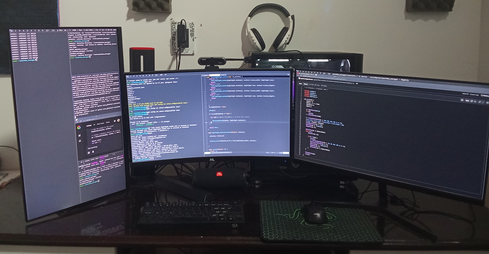

# pwindow_manager
#============================


pwindow_manager is an extremely fast, small, and dynamic window manager for X11.  
This is a fork of -suckless dwm(dynamic window manager)-  
I use as main window manager system in my desktop with 3 or 4 screen at the same time  


## Dependencies
------------
- X11 lib headers
- FreeType 2


Installation
------------
```
# make
# make install
```
This will install in /usr/bin

Running dwm
-----------
Add the following line to your .xinitrc to start dwm using startx:  

    exec pwindow_manager


Configuration
-------------
The configuration of pwindow_manager is done by modifying a custom config.h  
and (re)compiling the source code.
